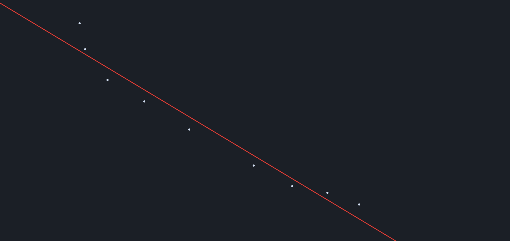
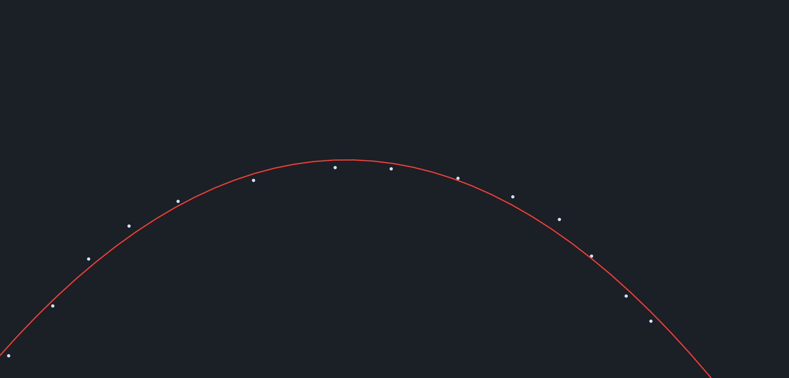
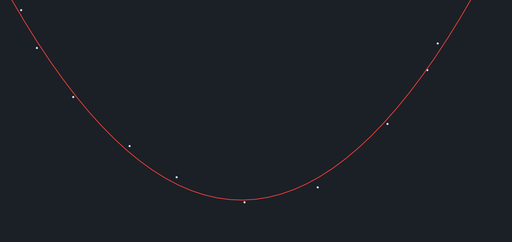

# Linear-Ploynomial-Regression
Finding the best fitting line/curve using points picked by user using Tensorflow.js.

Click anywhere on the canvas to place a point. 
The Neural Network will try to fit as best as it can.

Choose Linear/Ploynomial by clicking on their respective html files.

## About the Networks
I used mean squared error for the loss function.
I used stochastic gradient descent/momentum for the optimizer.

---
## Linear Regression Showcase:

## Polynomial Regression Showcase:

